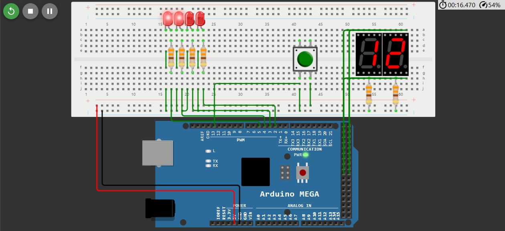

# Binary and Decimal counter Arduino Mega
## A basic electrionic counter circuit

#### Introduction:
A simple electrical ciruit built on Wokwi simulator.

# Wokwi Diagram

In this project, I have combined a binary counter which can count till 16 and a decimal counter (which is limited to count till 16) all on my own.
This project was made with no other references and just to test my understanding of the basics of arduino.

#### Key skills I applied in this project (In my humble opinion):
- Circuit Design
- Binary Counter
- Decimal Counter
- Header files
- Procedural programming
- Arduino device
- Optimization

# Circuit Diagram:

Feel free to try this console app by downloading the x86 or the x64 executable file I have uploaded.
